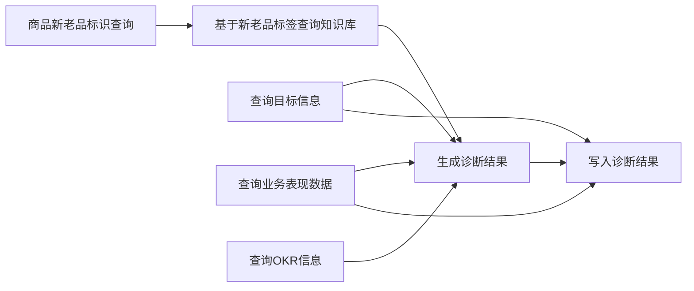

# 老品诊断与建议

## Overview

本技能对应「老品诊断与建议」标准操作流程：根据商品 ID 与日期范围，串联目标信息、业务表现数据、知识库与 OKR 等数据源，生成老品诊断报告（问题剖析、增长分析、改进建议），并支持将诊断结果持久化。执行时须严格遵循步骤依赖顺序。

## When to Use This Skill

**在以下情况使用本技能：**

- 用户表达包含「老品诊断」「老品建议」「老品诊断与建议」，或「给老品做诊断」「对某商品做诊断」
- 用户需要针对指定商品（需提供商品ID）做经营诊断、问题剖析、增长空间分析或改进优化建议
- 用户提供了 `goods_id` 和 `data_range`，并希望得到基于目标达成率、健康度、OKR 与知识库策略的综合诊断结果

**不适用：** 未提供商品 ID 或日期范围时，应先引导用户补全必填参数后再执行本流程。

---

## Inputs

| 输入 | 说明 | 必填 |
|------|------|------|
| **goods_id** | 商品ID，用于查询该商品的目标、业务表现、OKR 及新老品标识 | 是 |
| **data_range** | 诊断日期范围，格式为 `YYYY-MM-DD~YYYY-MM-DD`，如 `2025-12-07~2025-12-17` | 是 |
| **goal** | 诊断目标或意图，如「针对老品基于各项指标诊断」 | 否 |
| **description** | 补充说明 | 否 |

### 输入示例

```json
{
  "goods_id": "892207079412",
  "goal": "针对老品基于各项指标诊断",
  "description": "",
  "data_range": "2025-12-07~2025-12-17"
}
```

---

## Workflow（核心 SOP）

执行顺序必须满足以下依赖关系（知识库查询依赖新老品标识；生成诊断依赖所有查询结果；写入依赖生成结果与目标、业务数据）：



工作目录：各步骤产出的 JSON 默认写入 `WORKSPACE_DIR=/mnt/user-data/workspace/old_goods_diagnosis`，后续步骤从该目录读取依赖结果。**方式一**：本技能脚本 `scripts/run.py` 做分步编排（可选，无后端时返回桩数据）。**方式二**：用 bash 直接调用 data-fetch 的 `fetch_api.py` / `fetch_db.py`，按步传 URL 或 SQL。具体 URL/SQL 见 [references/data_fetch_mapping.md](references/data_fetch_mapping.md)。

---

## 通用数据获取（基于基础工具 + 脚本）

本技能的数据获取本质是：**接口查询**（URL + 请求参数）或 **数据库查询**（连接 + SQL）。不依赖 config 中注册 data_fetch_api/data_fetch_db，仅用**基础工具 bash** 调用 data-fetch 技能下的脚本即可：

- **接口查询**：用 **bash** 执行 `python /mnt/skills/public/data-fetch/scripts/fetch_api.py --url <URL> [--method GET] [--params '{}'] [--body '{}']`。详见技能 `data-fetch` 的 SKILL.md。
- **数据库查询**：用 **bash** 执行 `python /mnt/skills/public/data-fetch/scripts/fetch_db.py --sql "<SQL>" [--params '{}'] [--connection-url-env DATABASE_URL]`。连接串由环境变量提供。

两种执行方式：**方式一** 用本技能 `scripts/run.py` 做一站式编排；**方式二** 用 bash 直接调 data-fetch 的 `fetch_api.py` / `fetch_db.py`。各步骤与脚本的对应关系及具体 URL/SQL 由部署方在 [references/data_fetch_mapping.md](references/data_fetch_mapping.md) 或环境中配置：

| 步骤 | 建议方式 | 说明 |
|------|----------|------|
| Step 1 校验 | 逻辑判断或本技能脚本 | 无远程数据，仅校验 goods_id、data_range |
| Step 2 新老品标识 | bash + fetch_api 或 fetch_db | 接口：fetch_api 带 url + params/body；或 DB：fetch_db 带 sql + params |
| Step 3 目标/业务/OKR | bash + fetch_api 或 fetch_db | 三个请求可并行，各调一次脚本，差异仅在 URL 与参数 |
| Step 4 知识库 | bash + fetch_api 或 fetch_db | 依赖 Step 2 结果选择标签，再调接口或查库 |
| Step 5 生成诊断 | bash + fetch_api | 调用后端「生成诊断结果」接口，body 为前面步骤汇总 |
| Step 6 写入结果 | bash + fetch_api 或 fetch_db | 写入接口或 SQL |

示例（Step 2 用接口）：`bash` 执行 `python /mnt/skills/public/data-fetch/scripts/fetch_api.py --url "https://<base>/api/query_new_old_tag" --method GET --params '{"goods_id": "892207079412"}'`。  
示例（Step 3 用 DB）：`bash` 执行 `python /mnt/skills/public/data-fetch/scripts/fetch_db.py --sql "SELECT ... FROM target_info WHERE goods_id = %(goods_id)s" --params '{"goods_id": "892207079412", "data_range": "2025-12-07~2025-12-17"}'`。

---

### Step 1：校验必填输入

**规则**：任一项缺失则中止流程，向用户报错并提示补全。**产出**：通过则返回 `{"ok": true, "goods_id": "...", "data_range": "..."}`。

**方式一 — run.py 编排：**

```bash
python /mnt/skills/public/old-goods-diagnosis/scripts/run.py \
  --step validate \
  --goods-id "892207079412" \
  --data-range "2025-12-07~2025-12-17" \
  --workspace-dir /mnt/user-data/workspace/old_goods_diagnosis
```

**方式二：** 本步无远程数据，仅做输入校验；可用方式一 run.py，或自行判断后进入 Step 2。

---

### Step 2：商品新老品标识查询

**输入来源**：Step 1 通过后的 `goods_id`。**产出**：新老品标识写入 `step_new_old_tag.json`，供 Step 4 使用。

**方式一 — run.py 编排：**

```bash
python /mnt/skills/public/old-goods-diagnosis/scripts/run.py \
  --step query_new_old_tag \
  --goods-id "892207079412" \
  --data-range "2025-12-07~2025-12-17" \
  --workspace-dir /mnt/user-data/workspace/old_goods_diagnosis
```

**方式二 — bash 调 data-fetch 脚本：** 使用 **bash** 调用 `fetch_api.py` 或 `fetch_db.py`，传入本步骤对应的 URL 与 params/body，或 sql+params。详见 [references/data_fetch_mapping.md](references/data_fetch_mapping.md)。

---

### Step 3：并行查询目标、业务表现与 OKR

**输入来源**：`goods_id`、`data_range`，可选 `goal`、`description`。三项可并行执行，产出分别写入 `step_target_info.json`、`step_business_data.json`、`step_okr.json`。

**方式一 — run.py 编排（可并行执行三条）：**

```bash
# 3a 查询目标信息
python /mnt/skills/public/old-goods-diagnosis/scripts/run.py --step query_target_info --goods-id "892207079412" --data-range "2025-12-07~2025-12-17" --workspace-dir /mnt/user-data/workspace/old_goods_diagnosis

# 3b 查询业务表现数据
python /mnt/skills/public/old-goods-diagnosis/scripts/run.py --step query_business_data --goods-id "892207079412" --data-range "2025-12-07~2025-12-17" --workspace-dir /mnt/user-data/workspace/old_goods_diagnosis

# 3c 查询OKR信息
python /mnt/skills/public/old-goods-diagnosis/scripts/run.py --step query_okr --goods-id "892207079412" --data-range "2025-12-07~2025-12-17" --workspace-dir /mnt/user-data/workspace/old_goods_diagnosis
```

**方式二 — bash 调 data-fetch 脚本：** 用 **bash** 并行执行三次 data-fetch 脚本，分别传入「查询目标信息」「查询业务表现数据」「查询 OKR」的 URL+params/body 或 sql+params。详见 [references/data_fetch_mapping.md](references/data_fetch_mapping.md)。

---

### Step 4：基于新老品标签查询知识库

**依赖**：须在 Step 2 之后执行（脚本会读取 `step_new_old_tag.json`）。**产出**：写入 `step_kb.json`。

**方式一 — run.py 编排：**

```bash
python /mnt/skills/public/old-goods-diagnosis/scripts/run.py \
  --step query_kb \
  --goods-id "892207079412" \
  --data-range "2025-12-07~2025-12-17" \
  --workspace-dir /mnt/user-data/workspace/old_goods_diagnosis
```

**方式二 — bash 调 data-fetch 脚本：** 用 **bash** 调用 fetch_api/fetch_db，传入知识库查询的 URL+参数（需含 Step 2 的新老品标签）或 sql+params。详见 [references/data_fetch_mapping.md](references/data_fetch_mapping.md)。

---

### Step 5：生成诊断结果

**依赖**：Step 3 三项 + Step 4 均就绪（脚本读取 `step_target_info.json`、`step_business_data.json`、`step_okr.json`、`step_kb.json`）。**产出**：`diagnosis_content`、`diagnosis_content_json` 等写入 `step_generate_result.json`。

**方式一 — run.py 编排：**

```bash
python /mnt/skills/public/old-goods-diagnosis/scripts/run.py \
  --step generate_result \
  --goods-id "892207079412" \
  --data-range "2025-12-07~2025-12-17" \
  --goal "针对老品基于各项指标诊断" \
  --description "" \
  --workspace-dir /mnt/user-data/workspace/old_goods_diagnosis
```

**方式二 — bash 调 data-fetch 脚本：** 用 **bash** 调用 `fetch_api.py`，`--url` 为「生成诊断结果」接口，`--method POST`，`--body` 为汇总后的目标、业务、知识库、OKR 及 goal/description。详见 [references/data_fetch_mapping.md](references/data_fetch_mapping.md)。

---

### Step 6：写入诊断结果

**依赖**：Step 5 产出 + 目标信息 + 业务表现数据（脚本从 workspace 读取）。**产出**：写入成功/失败 JSON。

**方式一 — run.py 编排：**

```bash
python /mnt/skills/public/old-goods-diagnosis/scripts/run.py \
  --step write_result \
  --goods-id "892207079412" \
  --data-range "2025-12-07~2025-12-17" \
  --workspace-dir /mnt/user-data/workspace/old_goods_diagnosis
```

**方式二 — bash 调 data-fetch 脚本：** 用 **bash** 调用 fetch_api/fetch_db，传入写入接口的 URL+body 或写入用 SQL+params。详见 [references/data_fetch_mapping.md](references/data_fetch_mapping.md)。

---

### 脚本参数说明

| 参数 | 必填 | 说明 |
|------|------|------|
| `--step` | 是 | validate \| query_new_old_tag \| query_target_info \| query_business_data \| query_kb \| query_okr \| generate_result \| write_result |
| `--goods-id` | 步骤 1–3,5–6 需要 | 商品ID |
| `--data-range` | 步骤 1,3,5–6 需要 | 日期范围 `YYYY-MM-DD~YYYY-MM-DD` |
| `--goal` | 否 | 诊断目标，Step 5 使用 |
| `--description` | 否 | 补充说明，Step 5 使用 |
| `--workspace-dir` | 否 | 默认 `/mnt/user-data/workspace/old_goods_diagnosis` |

> [!NOTE]
> **方式一**：本技能 `run.py` 做一站式编排（无后端时可返回桩数据，便于联调）。**方式二**：优先用 **bash 直接调用 data-fetch** 的 `fetch_api.py` / `fetch_db.py`，按步传入 URL 或 SQL；各步具体 URL/SQL 与参数示例见 [references/data_fetch_mapping.md](references/data_fetch_mapping.md)。run.py 在未配置 `OLD_GOODS_DIAGNOSIS_API_URL` 时返回桩数据。

---

## Output

- **技能名称**：`skill_name` 为「老品诊断与建议」。
- **工具/步骤结果**：`tool_results`（或等价结构）包含各步骤产出；其中「生成诊断结果」步骤的输出包括：
  - **diagnosis_content**：Markdown 格式的完整诊断报告（核心结论、指标健康度、问题剖析、增长分析、改进建议）。
  - **diagnosis_content_json**：上述内容的结构化表示，便于下游展示或再处理。
- **写入结果**：若执行了 Step 6，则输出中应体现诊断结果已持久化及健康度等判定依据。

### 输出示例（顶层）

```json
{
  "skill_name": "老品诊断与建议",
  "tool_results": []
}
```

实际 `tool_results` 中应包含各步骤的返回内容；最终面向用户的交付以 `diagnosis_content` 及（若需要）`diagnosis_content_json` 为主。

---

## Quality Checklist

执行前后可自检：

- [ ] 输入包含 `goods_id` 与 `data_range`，且格式正确（日期范围为 `YYYY-MM-DD~YYYY-MM-DD`）。
- [ ] 「基于新老品标签查询知识库」在「商品新老品标识查询」之后执行。
- [ ] 「生成诊断结果」仅在目标信息、业务表现数据、知识库、OKR 信息均就绪后执行。
- [ ] 「写入诊断结果」在「生成诊断结果」之后执行，且写入时使用了目标信息与业务表现数据（用于健康度等）。
- [ ] 诊断内容中未直接套用知识库示例商品信息，且符合平台运营方法论与输出格式约束（如字数限制、禁止技术字段名等）。

---

## Notes

- 本 SOP 与 decision_support_agent 中的 `OldGoodsDiagnosisAnalysisSkill` 对齐：相同的必填/可选输入、相同的 7 个工具链及依赖关系、一致的输出含义。
- **脚本**：`scripts/run.py` 支持 `--step` 分阶段执行；各阶段产出写入 `--workspace-dir` 下 JSON，供后续步骤读取。配置环境变量 `OLD_GOODS_DIAGNOSIS_API_URL` 可对接真实后端，未配置时返回桩数据。
- **通用数据获取**：不在 config 中注册 data_fetch 类工具；用**基础工具 bash** 调用 `data-fetch` 技能下的 `fetch_api.py` / `fetch_db.py` 即可。本技能仅约定「各步骤需要什么数据」，具体 URL/SQL 由部署方在 `references/data_fetch_mapping.md` 或环境中配置。
- 更细的数据源说明、指标含义与输出字段定义可放在同目录 `references/` 下（如 `data_sources.md`、`output_schema.md`），按需加载以控制上下文长度。
